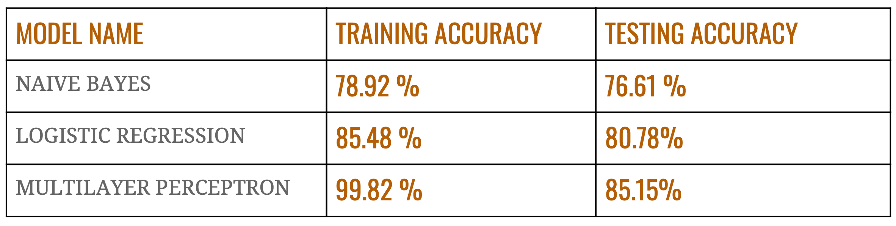

# Fake News Classification
The goal of this project is to explore how artificial intelligence technologies, particularly machine learning, deep learning and natural language processing, might be leveraged to combat the fake news problem.

Given the title of a fake news article A and the title of a coming news article B, we classify B into one of the three categories:
- agreed: B talks about the same fake news as A.
- disagreed: B refutes the fake news in A.
- unrelated: B is unrelated to A.

### Data
We have three CSV files:
##### train.csv: Training data
##### test.csv: Test data
##### sample submission.csv: Expected submission format
The training data includes the “label” of each news pair, while the test data doesn’t. Validation data can be split from train.csv. Training data should be used to train a classifier and evaluate a model's performance with the validation data. Finally, by using the trained model, we are required to predict the results for the test data. The format of our output file should be the same as “sample submission.csv” with our prediction replaced in the“label” column.

### Approach

To tackle the problem, we go through three steps as follows. Note that all the steps mentioned below are discussed in detail in the report.

#### 1. Data Preprocessing

As we are working with textual data, we do some preprocessing.
> Convert to Lowercase

> Remove punctuations

> Remove single character if any 

> Remove stop words

> Convert numbers to words

> Lemmatization to get root words

#### 2. Feature Extraction

To convert the textual data into features we use the strategies mentioned below

- *Similarity Feature* : Find similarity between A and B and use it as a feature

- *Bag of Words* - A bag-of-words is a representation of text that describes the occurrence of words within a document. It involves two things: (i) A vocabulary of known words; (ii) A measure of the presence of known words.

- *TF-IDF* : In TF-IDF, the term frequency measures the frequency of a word in a document and then divided by the total number of words in the document for normalization. Inverse of document frequency measures the informativeness of a particular term across documents.

#### 3. Data Modelling

Using the features that we created, we build three models to fit the data. Details of each model can be found in the report.

> *Naive Bayes*

> *Logistic Regression*

> *Multilayer Perceptron (Artificial Neural Network)*

#### Model Evaluation

For evaluating the performance of the models, we used an accuracy metric. The values for training and testing accuracy for each model are mentioned below. These values are calculated using TF-IDF vectors as a feature in each model. TF-IDF feature give better results than Bag-of-Words and Similarity approach.

#### Conclusion

- It was observed that features generated using TF-IDF method gave better results on every model than cosine similarity features. It can be justified as similarity calculations only take into account one feature but TF-IDF gives more information than that and creates better features.

- The Multilayer Perceptron Classifier gave better performance than two other models (Naive Bayes and Logistic Regression).

- In future, we plan to use both similarity and TF-IDF together as our features to create models.

- The data is highly imbalanced with respect to the labels. Due to this the model might be getting trained better on “unrelated” observation but struggles to make correct predictions of other labels. Hence, in order to get better results, we can use more data which is balanced and has more observations with “agreed” and “disagreed”.
